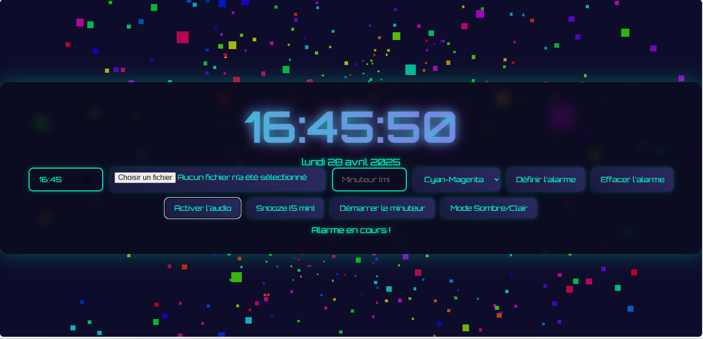

# futuristic-clock
# Horloge Digitale Futuriste

Une horloge digitale immersive avec un design néon et un fond animé arc-en-ciel 3D, développée avec HTML, CSS, JavaScript et Three.js. Elle combine des fonctionnalités pratiques (alarme, minuteur, affichage de la date) et une personnalisation visuelle (thèmes, mode sombre/clair).



## Fonctionnalités

- **Horloge digitale** : Affiche l’heure en temps réel (`HH:MM:SS`) avec effet néon.
- **Affichage de la date** : Date en français (ex. : "Lundi 28 Avril 2025").
- **Alarme** :
  - Définition d’une heure avec son par défaut ou personnalisé.
  - Snooze (report de 5 minutes).
  - Persistance via `localStorage`.
- **Minuteur** : Compte à rebours avec affichage du temps restant et sonnerie.
- **Personnalisation visuelle** :
  - Thèmes : Cyan-Magenta, Rouge-Bleu, Vert-Jaune.
  - Mode sombre/clair avec persistance.
- **Fond animé 3D** : Particules arc-en-ciel dynamiques via Three.js.
- **Robustesse** : Gestion des erreurs et messages clairs.

## Prérequis

- Navigateur moderne (Chrome, Firefox, Edge, etc.).
- Connexion Internet pour Three.js (CDN) et le son d’alarme par défaut.

## Installation

1. Clonez ou téléchargez le dépôt :
   ```bash
   git clone https://github.com/[jawed56]/[futuristic-clock].git

Ouvrez index.html dans un navigateur :
Double-cliquez sur le fichier, ou

Utilisez un serveur local :
bash

python -m http.server

Utilisation
Horloge et date : Affichées automatiquement.

Alarme :
Cliquez sur "Activer l’audio".

Choisissez une heure et cliquez sur "Définir l’alarme".

Utilisez "Snooze" (5 min) ou "Effacer l’alarme".

Chargez un son personnalisé (optionnel).

Minuteur :
Entrez une durée (minutes) et cliquez sur "Démarrer le minuteur".

Temps restant affiché, sonnerie à la fin.

Personnalisation :
Sélectionnez un thème dans le menu déroulant.

Basculez entre mode sombre/clair.

Fond 3D : Particules arc-en-ciel animées en arrière-plan.

Structure du projet

├── index.html       # Horloge (HTML, CSS, JS)
├── README.md        # Documentation
├── screenshot.png   # Capture d’écran (optionnel)

Technologies
HTML5, CSS3, JavaScript

Three.js : Fond 3D

Orbitron : Police futuriste

Déploiement sur GitHub Pages
Poussez le code vers un dépôt GitHub :
bash

git add .
git commit -m "Initial commit"
git push -u origin main

Activez GitHub Pages dans Settings > Pages :
Branche : main, dossier : / (root).

Accédez à : https://[jawed56].github.io/[futuristic-clock]/.

Démo
https://[jawed56].github.io/[futuristic-clock]/ (Mettez à jour après déploiement)
Dépannage
Fond 3D absent/lent :
Vérifiez le CDN Three.js.

Réduisez particleCount dans index.html (ex. : 800 à 500).

Alarme/minuteur sans son :
Cliquez sur "Activer l’audio".

Vérifiez le volume/source audio.

Horloge/date absente : Consultez la console (F12).

Mode sombre/clair inactif : Vérifiez localStorage.

Crédits
Développé par [Rabah Loudjani].

Son d’alarme : Universal Soundbank.

Inspiré par des designs futuristes et cyberpunk.

Licence
MIT License. Voir LICENSE pour plus de détails.
Donnez une étoile  si vous aimez cette horloge futuriste !
```

Personnalise :
Remplace [jawed56] et [futuristic-clock] par tes infos GitHub (ex. : jawed56/futuristic-clock).

Enregistre :
Sauvegarde sous README.md dans futuristic-clock.


"# futuristic-clock" 

